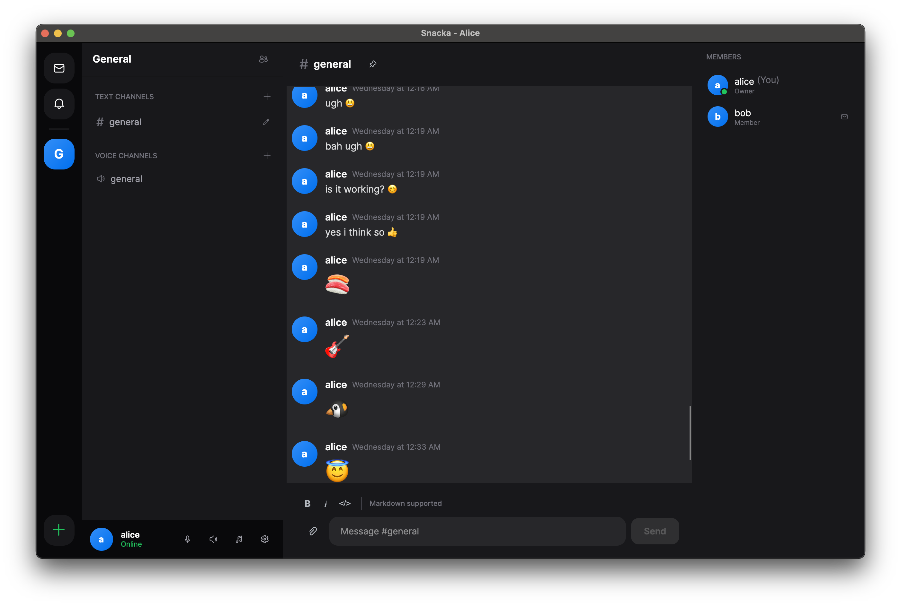

# Snacka

A self-hosted communication platform - like Discord, but you own your data.

<!-- Screenshot: Main app view with voice channel -->


## What is Snacka?

Snacka is a free, open-source alternative to Discord that you can host yourself. Run your own server on your own hardware or cloud infrastructure, with full control over your data and privacy.

Whether you're setting up a private space for friends, a team communication hub, or a community server - Snacka gives you the features you need without relying on third-party services.

## Features

### Text Communication
- **Direct Messages** - Private conversations with typing indicators
- **Text Channels** - Organized discussions with message editing and deletion
- **GIF Picker** - Search and share GIFs with Tenor integration
- **File Sharing** - Share images, audio files, and documents

<!-- Screenshot: Chat with GIF picker -->

### Voice & Video
- **Voice Channels** - Crystal-clear voice chat with WebRTC
- **Webcam Streaming** - Share your camera in voice channels
- **Screen Sharing** - Present your screen to others

<!-- Screenshot: Voice channel with participants -->

### Server Management
- **Communities** - Create and manage multiple communities
- **Channels** - Organize with text and voice channels
- **Roles & Permissions** - Owner, Admin, and Member roles
- **Invite System** - Invite users to your communities

<!-- Screenshot: Server settings or channel list -->

### Cross-Platform
- **Windows** - Native installer with automatic updates
- **macOS** - Apple Silicon and Intel support
- **Linux** - AppImage for easy installation

## Download

Download the latest version for your platform:

| Platform | Download | Notes |
|----------|----------|-------|
| **Windows** | [Installer](https://github.com/mattias800/snacka/releases/latest) | Recommended - includes auto-updates |
| **macOS** | [DMG](https://github.com/mattias800/snacka/releases/latest) | Apple Silicon (M1/M2/M3) |
| **Linux** | [AppImage](https://github.com/mattias800/snacka/releases/latest) | Run `chmod +x` before launching |

See the [Releases](https://github.com/mattias800/snacka/releases) page for all versions and portable downloads.

## Self-Hosting

Snacka is designed to be self-hosted. Run your own server with Docker:

```bash
# Clone the repository
git clone https://github.com/mattias800/snacka.git
cd snacka

# Configure your server
cp .env.example .env
# Edit .env and set your JWT_SECRET_KEY and other settings

# Start the server
docker-compose up -d
```

Your server will be available at `http://localhost:5117`. Point your Snacka client to this address to connect.

For detailed deployment instructions including production setup with HTTPS, see the [Deployment Guide](docs/DEPLOY.md).

### Server Requirements

- Docker and Docker Compose
- 1GB RAM minimum (2GB recommended)
- PostgreSQL (included in docker-compose)

## Getting Help

- **Issues**: [GitHub Issues](https://github.com/mattias800/snacka/issues)
- **Discussions**: [GitHub Discussions](https://github.com/mattias800/snacka/discussions)

## Contributing

Contributions are welcome! See [DEVELOPMENT.md](DEVELOPMENT.md) for development setup and guidelines.

## License

TBD

---

*Snacka is not affiliated with Discord. Discord is a trademark of Discord Inc.*
